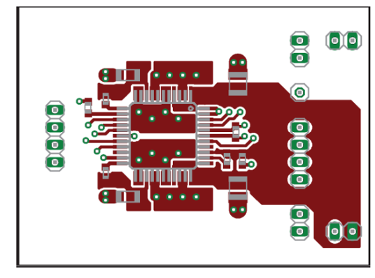
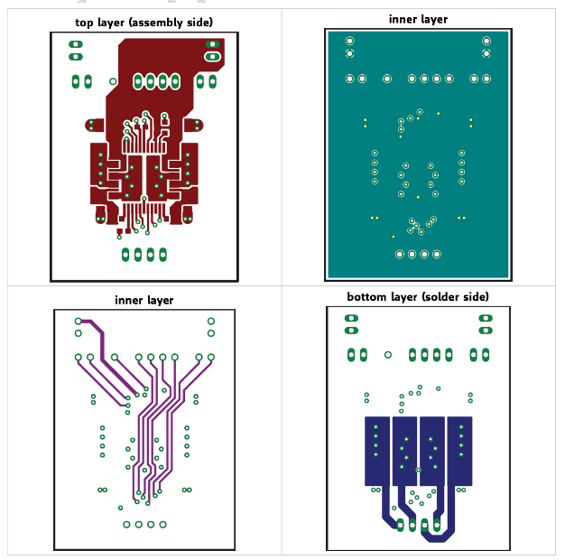
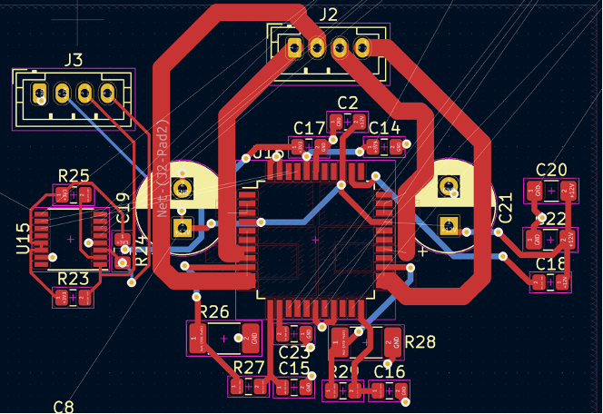
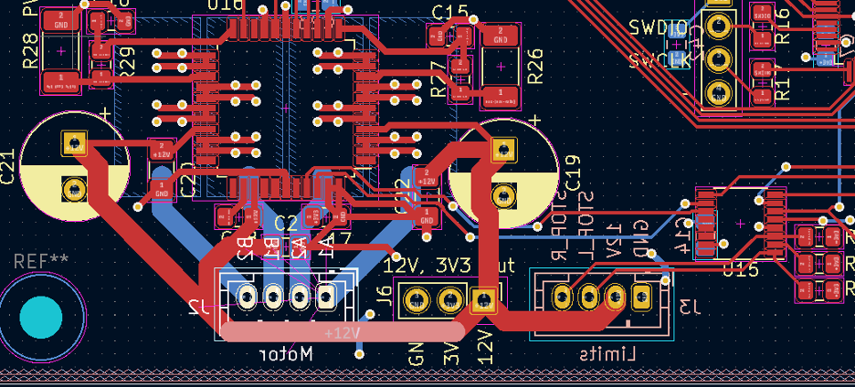
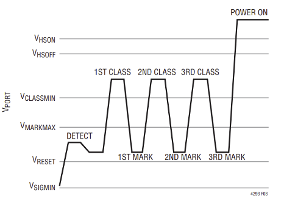
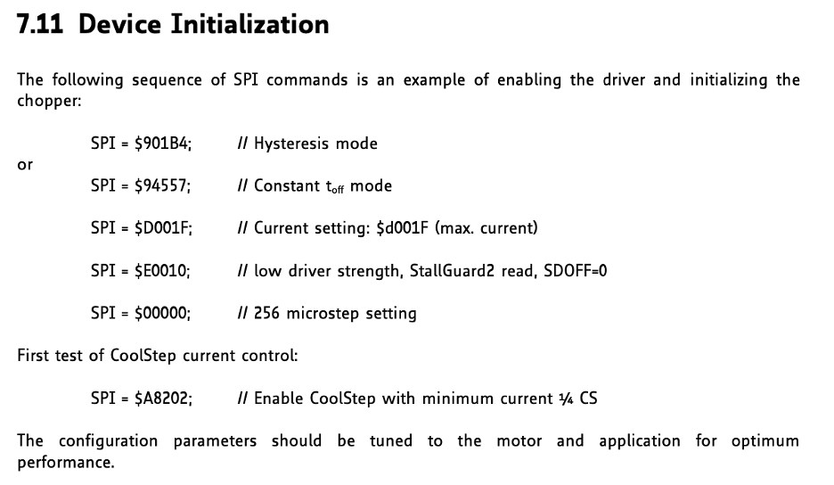
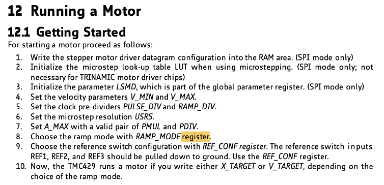
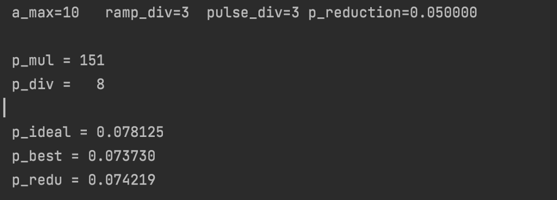

# February 28 2022

This session is dedicated to finishing up the parts list and finding replacement parts for things that were out of stock.

Previously, Bryan and Armando were working on the parts list while I was fixing up some parts of the design doc and doing the soldering assignment. As we were about to order some parts, we realized that some of them were out of stock. The two parts that were out of stock was the 46.4 Ω resistor and the 10 µF capacitor. I found replacement parts for them with the same packages which are https://www.digikey.com/en/products/detail/kyocera-avx/08052C103KAT2A/563455 and https://www.digikey.com/en/products/detail/vishay-dale/CRCW080546R4FKEA/1180630 respectively.

# March 2 2022

I am responsible for the PCB design for the motor control subsystems. Below are the following layout considerations that I have found for the TMC2660[1]:
1.	Sense resistors must have different traces to ground to minimize resistance.
2.	Traces from OA and OB pins from the 2660 chip to the motor must be thick and symmetrical so that there is proper heat dissipation
a.	Use field zones for this as it allows for areas for heat dissipation
3.	Wide traces for VSA, VSB, BRA and BRB pins as they may dissipate up to 2A of current.
4.	470nF ceramic filtering capacitor must be placed as close as possible to 5VOUT pin and using traces that are thick.
5.	100nF filtering capacitor should be placed as close as possible from VS pin to ground.
6.	motor supply pins, VSA and VSB, should be decoupled using a >100uF electrolytic capacitor and a ceramic capacitor, placed close to the device.
7.	Place >100nF capacitor for VCC_IO close to the supply pin.

Below are the example layouts that the datasheet has provided and which I can take ideas from.





As for the TMC429, according to the datasheet, there is not much information about it and this makes sense as it is a motion controller chip, all it does is that it takes SPI commands from some input and then output into a driver daisy chain in order to drive the motor. Taking all this into consideration, below is the result of the first draft of the motor control subsystem PCB design.



# March 4 2022


After reviewing the first draft of the motor control PCB, bryan and I decided to change a number of things as well as making it neater. One of our main concerns was that in the first draft, it had too much white space so, we decided to move components more compact. We also decided to place the limit, power and motor headers to be roughly on same level and on one edge as can be seen above. One more major change that we did was that for each motor pin, we used identical field zones instead so that there was better symmetry which will help to thermally optimize the design.

# March 5 2022
As we were buying parts, we realized that the PSMN040-100MSE MOSFETs for the diode bridge has gone out of stock. We have checked for both American vendors (Digikey, Mouser, etc…) and others such as Alibaba, LCSC, etc… and neither of them has stock. Hence, this session will be dedicated to look for replacement MOSFETs.

Firstly, it is important to note that the PSMN0401-100MSE has these following relevant ratings: Vds (drain-source voltage) of 100V, Id(continuous drain current) of 30 A and Pd (Power Dissipation) of 91 W. Hence, it is important to find replacements that has similar ratings. It is also important to note that the PoE++ standard that we will be using has a 48 V and 60 W rating therefore, it should be reasonable and safe to find replacement mosfets that has weaker and smaller ratings. The following are the replacements that we have found:
    1.	BUK7M12-60EX (https://www.mouser.com/ProductDetail/Nexperia/BUK7M12-60EX?qs=VNgDqqxT8YUpBXntfylSwg%3D%3D)
    2.	IRLML0100TRPBF (https://www.digikey.com/en/products/detail/infineon-technologies/IRLML0100TRPBF/2202214)
    3.	nDMN6068LK3-13 (https://www.digikey.com/en/products/detail/diodes-incorporated/DMN6068LK3-13/2179793)

In the end, we chose to use the BUK7M12-60EX as the replacement MOSFET for a number of reasons: has the highest power dissipation, close Vds, adequate Id and manufactured by the same company that manufactured the original MOSFET chip which specializes in making ones for PoE applications.

# March 10 2022

The objective of this session is to start brainstorming and working on the ethernet data portion of the project. I aim to find some working examples and libraries that will allow the ethernet PHY chip to accept packets and so that we are able to ping it from a local network. This will later on lead to printing the packets on a serial monitor via UART communication.

To start with, we were looking for examples that work with the DP83848 and the STM32F4-Discovery board and we have found an example to work with and try to ping it. The following link has the example for it: http://blog.tkjelectronics.dk/2012/08/ethernet-on-stm32f4discovery-using-external-phy/ . Although the example has the project on System Workbench and CooCox IDE of which we do not have access to, there are still source codes on it that should work. As we are working on Cube, there was a lot of things to configure but for this session, we spent most of the time fixing include issues but still not finished yet.

# March 11 2022

This session will be dedicated to continue fixing the issues from before as well as testing to ping it.

We have finished fixing the include issues for this example project and have begun to test it. Firstly, we started to try to ping it using the static IP address set on the board from the computer. However, this has resulted in all packets being lost meaning that the STM32F4-Discovery board with the DP83848 board is not detected in the network. We tried to troubleshoot this and the first thing that we noticed was that some jumpers were loose hence we replaced them with new jumpers however, this yielded no results. Next, from reading online, many people have noted that they were unable to ping this either however, upon changing jumpers on the PHY board to shorter ones, approximately 5 cm, they were able to ping it. This led to us soldering jumper wires on the pins of the PHY board with 5 cm length however, this again did not solve our problem. As a simple ping did not work, this indicates that the problem might be due to the STM32 chip might not be initializing the PHY chip properly. Therefore, we have looked into other examples. A promising example we have found is the library made by Tilen Majerle. He has provided several examples as well as features that his library provides. His set up also uses the STM32F4-Discovery board and the DP83848.

References:

tilz0R, “Library 52- ethernet peripheral on STM32F4xx,” STM32F4 Discovery, 18-Mar-2015. [Online]. Available: https://stm32f4-discovery.net/2015/02/library-52-ethernet-peripheral-on-stm32f4xx/. 

# March 22 2022

The objective of this session is to look into the STM32F4 library for ethernet by Tilen Majerle of which I mentioned before. By the end of this session, I aim to have a good grasp of what the library does and ideas on what functions/changes I would need to make on the examples given so that it works on the current project. 

First thing that we need to make sure is that the ETHERNET_PHY variable is defined as 0. This is so that we are sure that the type of PHY chip that the module uses is the DP83848. To do this, it is as simple as writing “#define ETHERNET_PHY 0” in the defines.h file.

Next on, there are two important update functions that we must take into consideration. They are TM_ETHERNET_TimeUpdate and TM_ETHERNET_Update functions. The time update function must be called periodically and with the parameter of its period. E.g, if you are to call it every 10 ms, then call TM_ETHERNET_TimeUpdate(10);. The use of this function is to update the PHY chip that 10 ms has passed. The 10 ms will then be added into the LwIP stack which the TCP/IP protocol runs on. As for the TM_ETHERNET_Update function, you just have to call it as fast as possible. What this does is that it just updates the LwIP stack.

Next on, in order to allow the STM32F4-Discovery to be able to both receive and send back information, we need to make sure that it is in full duplex mode.

Moving on, we can use either DHCP or use a static IP for the device. For the final implementation of the project, DHCP is desired but as we are still in the development process, it would be much more convenient to have a static IP so that we know everytime where to send packets to. In order to set a static IP address, we can just write in defines.h like so:

```
#ifndef IP_ADDR0
#define IP_ADDR0                            192
#define IP_ADDR1                            168
#define IP_ADDR2                            0
#define IP_ADDR3                            120
#endif

#ifndef NETMASK_ADDR0
#define NETMASK_ADDR0                        255
#define NETMASK_ADDR1                        255
#define NETMASK_ADDR2                        255
#define NETMASK_ADDR3                        0
#endif

#ifndef GW_ADDR0
#define GW_ADDR0                            192
#define GW_ADDR1                            168
#define GW_ADDR2                            0
#define GW_ADDR3                            1
#endif
```

Else, if we need to use DHCP instead, it is possible to just write “define ETHERNET_USE_DHCP” in defines.h instead.

Next on, I found an interesting feature that the library provides that may be used for testing later. It is the feature of CGI handlers. CGI handlers’ purpose is so that devices connected to the microcontroller can be controlled via ethernet and via a link. E.g entering something like 192.168.0.120/my_url.cgi?ledon=1&ledoff=3&ledtoggle=4 will turn on LED 1, turn off LED 3 and toggle LED 4. In the blog writing about the library, it is described as “a way on how to handle GET method with url link”. I think that this can be useful later for testing purposes.

Lastly, there are several examples to be able to run the discovery board as a TCP server which we aim to do on the site. As now I know the things to keep in mind, this session is over and the next session will be dedicated to testing this out.

References:

tilz0R, “Library 52- ethernet peripheral on STM32F4xx,” STM32F4 Discovery, 18-Mar-2015. [Online]. Available: https://stm32f4-discovery.net/2015/02/library-52-ethernet-peripheral-on-stm32f4xx/. 

# March 24 2022

The objective of this session is to start testing out examples that the author has provided on the website. If it does not work then we will debug it.

So the first thing that we had to do while testing out the examples was to fix the include issues. This was not fixed only by doing includes but also we had to change paths and symbols in the IDE which turned out to make our lives much easier. After that, we ran it and tried to ping it. It failed just like how the previous example we used did. I tried to look at my router’s homepage as well and it is not seeing any devices on the network connected to ethernet. Afterwards, I tried to look at wireshark to look at the packet transmissions within the network but I did not find the MAC address of the device during the packet transmissions. As we are using static IP for this, we should be able to expect communication between the router and the board stating that it has a static IP address and sends its static address back. As there is no such communication with the MAC address, I do not think that the board is really communicating with the network. This concludes today’s session and I will debug it again.

# March 27 2022

This session will be written on the past 3-4 days of working on the ethernet software. The objective of this session is to debug the ethernet software and looking for alternative solutions for this.

While working on the ethernet, I have tried to debug it but no further progress has been done. Firstly, I tried to read into the library again and see if there were any changes that should be made. However, it seems that the changes I have made before and the things that I have written on defines.h seem to be sufficient according to the example that they have given. I tried to run the example where you should be able to toggle the LEDs using CGI handlers but I can neither toggle the LEDs on or off or even ping the device. The readings on wireshark seems to be showing the same results – there is no communication between the network and the device as I can not see the device’s MAC address anywhere. Because of no leads I can find, I decided to follow an example by controllerstech.com. The example that they have provided uses Cube’s LwIP stack and ethernet communication technology stack. I think that this is a much better example and guide since it not only just states what certain functions are for and what to look up for but explains the values that they have used. This concludes today session and I will be working on the example by controllerstech next.

“STM32 ethernet #1. connection " controllerstech,” ControllersTech, 12-Dec-2021. [Online]. Available: https://controllerstech.com/stm32-ethernet-1-connection/. 

# March 30 2022

This session is dedicated to the last 2 days of working on controllerstech. I aim to understand what they are doing, how STM32Cube works to set up ethernet and just trying to run the examples they have provided.

Reading on the controllerstech example, below are a list of things that I have to configure on STM32CubeIDE in order to get it working:
-	Set PHY address as 1 as we are using an external PHY chip
-	Set static IP, gateway address and subnet mask according to the local network’s settings
-	Use 10 kB memory size for the LwIP heap 
-	use the following code while adhering to STM32Cube’s code zones:

```
/* USER CODE BEGIN 0 */

extern struct netif gnetif;

/* USER CODE END 0 */

...........MAIN..........

  while (1)
  {
    /* USER CODE END WHILE */

    /* USER CODE BEGIN 3 */

	  ethernetif_input(&gnetif);

	  sys_check_timeouts();
  }
```

After setting up the code and configuring above, we tested the code and see if we were able to ping it. Unfortunately it showed the same results as before where I couldn’t ping it and wireshark did not see the device receiving or transmitting any packets. This is weird because although it says that, I can see the status LEDs on the PHY board blinking which signifies that it is seeing packets coming through. It has been quite frustrating and so, I will move on to working on other parts of the project first.

# March 31 2022 

As Bryan and Armando have finished the soldering of the boards, we can now start to work on the hardware. Hence, this sessions objective is to do initial tests on the hardware. I also aim to continue to work on the ethernet software.

Firstly, we made sure that we were able to program our STM32 MCU. In order to do this, we used STM32CubeIDE to program the MCU. We then connected the ST-Link via the SWD headers that we broke out. As we wanted to just do a simple program, we decided to just make the status LED that we have routed to the MCU blink and did this by using HAL (Hardware Abstraction Layer) to control the LED and use delays so that it blinks periodically. After the program downloaded successfully, unfortunately, the LED did not blink. After some time, we realized that we selected the wrong MCU in the Cube project. Instead of choosing STM32F407VET, we chose STM32F407VGT. The difference between the two MCUs are that the VGT chip has 2x the flash size of the VET and that may have caused the problem. After fixing that, we were able to blink the LED and so we can verify that the chip is fine.

After that, we conducted a power test on the PoE. By this, we believe that by connecting the RJ45 port onto the network switch on the PoE++ port, we believe that there should be power delivered and that the status LED in the ethernet subsystem should be turned on. We have tried two standards for both PoE+ and PoE++ standards by plugging in headers on the board to the desired standard and for both, it did not work. We then checked the voltage across the ethernet pins and discovered that there was no voltage across it. Therefore, we can conclude that there is no power being transmitted. I think that this happened because of either the PoE negotiation failed or no negotiation was happening at all. This may be because of faulty chips somewhere on the board but this concludes working on the ethernet hardware.

Whilst working on the ethernet software, I tried to search online to look at why the ethernet software might not be working for the development board and the ethernet board. There has been a lot of posts online that state that the LwIP stack is not working. However, I did find that from 3 years ago, a user stated that Cube generated the wrong code for the parameters, one particularly stating that the PHY address on the code is generated wrongly. Instead of it defined as 1, it is defined as 0. Reading the code again in my project however, I can confirm that it is defined as 1. I have looked into other parts of the code that required generation such as the IP address, subnet mask, gateway address, etc… but they appear to be fine. I am not sure why this happens but this concludes today’s session and I will look into it further.

References:
St Community. [Online]. Available: https://community.st.com/s/question/0D50X00009nM9wPSAS/lwip-problems-from-code-generated-via-stm32cubemx-smt32h7.

# April 4 2022

This entry is dedicated to working on the past 2-3 days of working on debugging the PoE circuit and working on the ethernet. Mainly, we aim to troubleshoot and identify which parts may be buggy by switching parts with the DC2911A LT4293/LT4321 eval board. 

So during this session, the first thing that me and Bryan thought to do was to switch the PD controller as this component was the one doing the PoE negotiation. After switching the PD controllers on the DC2911A dev board and our board, we discovered that PoE still works on the dev board but not on our board. Then, our next switch was the LT4321A diode bridge controller component. We decided to switch this out as the PoE negotiation also goes through this component but alas, we got the same result as we did when we switched the PD controller. Lastly, we switched out the MOSFETs from the dev board with the one on our board. We thought again that this might be the problem because the MOSFET chips that we had used were ones that had a substantially lower rating than that of the dev board but again, it still works on the dev board but not on our dev board. We are still not sure why PoE does not work on our board. 

As for working on the ethernet software, I have researched again on causes why data transmission may have failed. Some of which I have found are issues related to how STM32CubeIDE’s ethernet peripheral code is tangled with many problems and they are planning to rework the driver in the future. As this seems infested by too many problems and I feel that I am facing a mental block, I am going to temporarily stop working on this part and work on other parts of the project first.

References: 

St Community. [Online]. Available: https://community.st.com/s/question/0D50X0000BOtfhnSQB/how-to-make-ethernet-and-lwip-working-on-stm32. 
St Community. [Online]. Available: https://community.st.com/s/question/0D53W00001BwbrSSAR/stm32f4x-halethreadphyregister-blocking-mode

# April 6 2022

This session is dedicated to working on debugging and identifying problems in the PoE circuitry. I also aim to start looking at how to communicate with the driver and motion controller chips in the motor control subsystem to get them working.

Firstly, we read the datasheet of the PD controller. We see on the datasheet that even if the PoE negotiation was unsuccessful, there would still be some voltages happening on the PD controller as they have a “detect” signal they would send. They describe the entirety of the PoE negotiation as follows: it first has the detect signal by applying voltages in the range of 2.7 V to 10.1 V and measure the corresponding currents. If a PoE circuit is detected, it would then apply classiiication signals to decide which PoE class/standard it is working on. An example of the negotiation should look like the image below.



Having this knowledge in mind, we scoped the PD controller to look for detect signals. However,  there are no changes in the voltage when we repeatedly plug the ethernet cable in and out of the ethernet port. This was absurd because either way the network switch should have had a detect signal even if the board was not meant for PoE. This concludes today’s session and we will look into it again.

# April 9, 2022

The objective of this entry is to cover the last 2 days of working on continuing to identify the problem with the PoE circuitry. 

Over the past 2 days, we have identified what the problem was; it was the RJ45 port. We found this out because it does not seem as if any other components were much too different to that of the development board. After looking into the schematic of the RJ45 port, we realized that there is an internal transformer. Theoretically, I believe that this should work with non-PoE communications but the internal transformer prevents PoE negotiation from happening. This is so because essentially, the DC signals does not pass through the transformer which prevents any power delivery or negotiation hence why it is not working. 

We then proceeded to switch out the RJ45 port from our board to the RJ45 port on the DC29111A dev board. After we did this we saw a PoE fault signified by an amber light on the network switch. A PoE fault may mean a number of reasons but one of them is that something is shorted. This concludes today’s session and we will be identifying why this has happened. So far, I think we have made decent progress on the PoE circuitry.

# April 10 2022

The objective of this session is to further debug what caused the PoE fault in the PoE circuitry.

Continuing on from the previous session, we were stuck at a PoE fault. We also had it on the PoE++ standard. When we switched it to the PoE+ standard, it worked fine as there was no more amber light on the PoE+ port of the network switch indicating that there is no PoE fault occurring. This was a little bit confusing because if one standard works then that surely means we have most if not all correct as they both go through the PoE PD controller to do negotiation, it also goes through the diode bridge and its controller to pass on voltage . Also. we noticed that when using the PoE++ standard was being used, the amber light would not be consistently on. It would be in either of two states: having a PoE fault or nothing working at all. We also verified that 48 V is coming through as when we measured for voltage using a multimeter on the ethernet port when using the PoE+ standard, we measured just above 50 volts which is to be expected. 

To be able to identify the problem, we then investigated parts which were exclusive to the PoE++ circuitry. We checked the resistors RCLASS first and they seemed to work fine and are soldered well. We then looked at the MOSFETs on the diode bridge and realized one of them was shorted. This may have happened because the MOSFET that was currently being used was from the development board which were soldered on using unleaded solder which takes a much higher melting point. Whilst desoldering the MOSFET from the DC2911A dev board, this may have caused damage to the faulty MOSFET. After switching, the PoE++ standard fortunately worked.

# April 12 2022

This session is dedicated to the last 2 days of working on debugging the board.

After we got it working, the board got shorted somewhere. We know this because there was no 3.3V output anymore. After scoping the board for a good amount of time, we discovered the problem. We realized that the PHY chip on the board was damaged and caused a short between the ground and 3.3V lines. Removing the PHY chip removed the short however, there was still no output going out of the 3.3V regulator. After verifying that there indeed was 12V going into its input, we realized that when the board got shorted, it must have damaged the circuit. After we replaced the regulator, the circuit worked fine again.

When we fixed the problem, we tried to look for as to why the PHY chip was shorted. Fortunately, we found a thread online that had PoE in their circuit and used the same PHY chip as we did. They found out that the reason why it shorted was due to transient voltages from PoE that gets coupled into the transformer and then into the Tx lines which have damaged the PHY. A solution we have thought for this is to use a TVS diode on the ethernet port to minimize transient voltages going into these lines. This concludes this session and we plan to work on the ethernet software going forward. 

References:

“DP83848 chip failures,” DP83848 chip failures - Interface forum - Interface - TI E2E support forums. [Online]. Available: https://e2e.ti.com/support/interface-group/interface/f/interface-forum/522510/dp83848-chip-failures. 

April 14 2022

This session is dedicated for me to start working on the motor control software on the last 2 days.

Firstly, I started working with Armando by continuing where he left off. He written his own drivers by using functions provided in the TMC API with their abstraction as well. As I was writing code and helped him to finish it, we tested it out and nothing happened i.e. the motor did not move and there was no indication that it had been configured. Hence, we then scrapped this idea and wrote our own drivers that sends SPI commands to configure and command the motors. We believed that this was the best step forward as this will help us to get a better understanding of our code and also we can customized it better to make any needed modifications.

We first worked on the TMC 2660. According to its datasheet the following is how you would configure it to start up the motor.



After we tested it out using the same command except for E0010 and set SDOFF = 1, nothing happened. We tried to look into the datasheet as to why nothing happened and found out some things we were not doing such as using SPI mode 3 and had to change the SPI frequency. However, we were not able to move it and hence this concludes our session and we will continue on this.

References:
TMC2660 TMC2660C Datasheet - Trinamic. https://www.trinamic.com/fileadmin/assets/Products/ICs_Documents/TMC2660C_Datasheet_Rev1.01.pdf. 

# April 16 2022

This session is dedicated to the last 2 days of working on the software for the motor control subsystem. 

Over the past few days, we have encountered some problem and have fortunately solved them. The first thing was that I misunderstood about how the device initialization worked. Because we were communicating with the chip via SPI, I assumed that this meant we were operating on SPI mode. However, as we are taking in STEP/DIR pulses instead from the motion controller it is actually in STEP/DIR mode. Hence, we had to enable the step/direction mode by reverting to the default steps on the datasheet.

After that, we realized that when using an oscilloscope, we saw that the clock generated by the MCU going into the TMC2660 was rather noisy. Hence, we instead used its internal clock by creating a solder bridge between the CLK and GND pins on the 2660. Afterwards, we used an arduino to generate step/dir pulses that goes into the headers we have broken out on the board. We verified that the motor was able to move and the next days we will be working on configuring and commanding the TMC429.

# April 19 2022

This session is dedicated to working on the TMC429 to configure and command it.

We have worked on the 429 for the last 2 days. From the datasheet this is what they had to get started with it : 



However, as we are using this in STEP/DIR mode, the getting started instructions can be simplified as below:

1.	Set the velocity parameters V_MIN and V_MAX.
2.	Set the clock pre-dividers PULSE_DIV and RAMP_DIV.
3.	Set the microstep resolution USRS.
4.	Set A_MAX with a valid pair of PMUL and PDIV.
5.	Choose the ramp mode with RAMP_MODE register.
6.	Choose the reference switch configuration with REF_CONF register. The reference switch inputs
REF1, REF2, and REF3 should be pulled down to ground. Use the REF_CONF register.
7.	Now, the TMC429 runs a motor if you write either X_TARGET or V_TARGET, depending on the
choice of the ramp mode.
Below are the commands we have set for the TMC 429

Set velocity parameters V_MIN and V_MAX
1.	0 00 0010 0 xxxx xxxx xxxx x vmin11bits
a.	0000 0100 0000 0000 0000 0000 0000 0111 = 0x04000007
2.	0 00 0011 0 xxxx xxxx xxxx x vmax11bits
a.	0000 0110 0000 0000 0000 0111 1111 11111 = 0x060007FF

Set the clock pre-dividers PULSE_DIV and RAMP_DIV.
1.	0 00 1100 0 xxxx xxxx pulsediv4bits ramp_div4bits xxxxx usrs3bits
a.	0001 1000 0000 0000 0011 0011 0000 0000 = 0x18003300
Set A_MAX with a valid pair of PMUL and PDIV.
1.	0 00 0110 0 xxxx xxxx xxxx x a_max11bits
a.	0000 1100 0000 0000 0000 0000 0000 1010 = 0x0C00000A
2.	0 00 1001 0 xxxx xxxx 1 pmul7bits xxxx pdiv4bits
a.	0001 0010 0000 0000 1001 0111 0000 1000 = 0x12009?0?
Choose the ramp mode with RAMP_MODE register.
1.	0 00 1010 0 xxxx xxxlp1bit xxxx ref_conf4bits xxxx xx ramp_mode2bits
a.	0001 0010 0000 0000 0000 0011 0000 0000 = 0x14000300
Now, the TMC429 runs a motor if you write either X_TARGET or V_TARGET, depending on the choice of the ramp mode.
However, we do not yet know what to set for p_mul and div_mul yet as for these parameters, if you set it at a non-compatible value, the motor may either overshoot when arriving at a position or move too slow. Next session will be used to figure out what these values are.

References:

Motion Controller for Stepper Motors Integrated ... - Trinamic. https://trinamic.com/fileadmin/assets/Products/ICs_Documents/TMC429_datasheet.pdf.

# April 20 2022

This session is dedicated to finding the p_mul and p_div parameters and also testing out the motor control subsystem.

After reading the datasheet further, we realized that TMC provides a program to calculate p_mul and p_div. So these two parameters are what is used for the proportionality factor in the algorithm in the TMC429 chip that calculates velocity and acceleration with p = p_mul/p_div. In the datasheet it says that a p too big will cause the motor to overshoot and a p too small will cause the motor to move too slow. After using the program they have provided, this is what we got and will use for said parameters.



And so, the final SPI commands are 
0x04000007  // v_min = 7 steps per unit time
0x060007FF // v_max = 2047 steps per unit time
0x18003300  // pulse_div = 3, ramp_div = 3
0x0C00000A // a_max = 10 steps per unit time
0x1200E808 //
0x14000300//

After that we tested out the code by commanding the TMC429 to move using SPI commands. The result was that for ramp_mode which is used to position the motor, it doesn't really work. Sometimes it moves and moves jittery or it doesn’t move completely. If we instead use it in velocity mode to keep it moving at a constant velocity, it moves constantly but when we change the velocity, it still remains at the same velocity. We still have to debug this issue.

References:
Motion Controller for Stepper Motors Integrated ... - Trinamic. https://trinamic.com/fileadmin/assets/Products/ICs_Documents/TMC429_datasheet.pdf. 

# April 22 2022

This session is dedicated to the last 2 days of working on debugging the motor control subsystem.

After two days of oscilloscope the circuit, the hardware seemed fine and we did not find any obvious problems in it. Then, we continued to further read the datasheet and found out that at a default, the TMC429 acts like a TMC428 chip. This means that the TMC429 was not sending STEP/DIR commands and instead sends SPI commands. Hence why it did not work.

The solution to this problem is to configure the IF_CONFIGURATION_429 register in the TMC429 chip and make sure that we enable step/dir there. And the SPI command to do that is 0x68000021. After that, we were able to send SPI commands and the motor moved accordingly. We then were able to also verify the motor control subsystem as when we moved the motor by one full rotation, we see that it has to move by 52800 microsteps which fulfills its requirement. We will start to work on the UART communication.

# April 23 2022

This session was initially dedicated to the UART communication however, we accidentally bricked the MCU and so this is also dedicated to debugging the MCU.

Before we worked on UART communication, we wanted to test out the PHY chip again. However, it shorted quickly after we connected our board to the PoE network switch so, we removed it and replaced the 3.3V regulator and the board worked fine again.

While we implemented code for UART communication, we had configured it for UART communication through UART. We wanted the MCU to be able to receive UART data through DMA which works like an interrupt. We used the example from controllerstech.com. We used the DMA method because we wanted non-blocking code so that the MCU can work on other functions (in future development) without having to wait for receiving UART packets. We had finished configuring the MCU and wanted to test the code. However, as we were programming, one of the jumpers for the st-link was loose and got unplugged. When we next tried to program it, we kept on getting ERROR: Failed to erase memory. Upon further inspection using the Cubeprogrammer, we see that the MCU had a read protection value of 0xFF when it should only be either of 0xAA, 0xBB or 0xCC. There was no way to fix this with the tools we had so this concluded our section and we plan to switch the STM32 MCU with another one. 

References:

“How to receive UART data in STM32,” CONTROLLERSTECH, 21-Jul-2018. [Online]. Available: https://controllerstech.blogspot.com/2018/07/how-to-receive-uart-data-in-stm32.html.. 


# April 24 2022

This session is dedicated to replacing the MCU and also finish up on UART communication.

This session started out by switching out the STM32F407VET on our board with a STM32F407VGT MCU that we had. The only difference between the two chips are the flash size hence, everything should still work fine. After soldering it on our board, we were able to verify that the MCU is programmable which is a big relief. However, the motor was not moving anymore. We probed the MCU pins that the SPI peripheral for the 429 uses and found that the chip select pin was not changing and that in essence, it did not produce any signal. We suspect that this is due to the fact that the MCU must have been old and that was malfunctioning. So, we assigned the chip select for SPI to another pin and then soldered a jumper to it and connected it to the chip select header we broke out on the board. It then worked fine.

Continuing from this, we were able to set up the UART communication properly. For receiving commands and then do said commands for the motor. We were able to move the motor to a position and move it at constant velocity. However, we were unable to properly send data from the board to a serial monitor via UART.  We are unsure why but we plan to finish this problem tomorrow before the demo. We also plan to enable the stop switches function for the motor driver. 

# April 25 2022

Today was dedicated to finishing the UART communication and enabling stop switches.

First, we worked on enabling stop switches. What we had to do was to replace 0x14000300  when configuring the TMC429 with 0x14000000. Now, the reference switch should be disabled. However, we ran into a problem where the reference switch is never enabled. After some time reading the code and debugging, we realized that this is because we repeatedly send 0x14000300 when we are commanding the motor to move. By replacing this with 0x14000000 for every time we send the motor, the stop switches now work. 

Next, we were working with the UART communication. When initially working on this, we see that the data sent back is completely wrong. For example, when we set the position to 0 the data sent back when we tried to get its position is some other big number which is completely incorrect. Initially we thought that it might be due to the jumpers but after replacing the jumpers with newer ones, the problem still persisted. Then we realized it was a timing issue. 

Then on, our demo got pushed back to wednesday and it gave us a chance to work on ethernet again and so, we plan to work on that tomorrow and I read and tried to figure out what is wrong with it tonight. 

# April 26 2022

This session is dedicated to get ethernet working just before the demo day.

Firstly, on the hardware side, so that the ethernet PHY does not get damaged again, we connected jumpers from a DP83848 waveshare board to ethernet PHY headers we broke out on the board. While working on this, we first did the set up that controllerstech.com has instructed for ethernet. After following it, we tested ethernet on our board using the network switch and connected it to a router. However, the results were the same as before. We were still unable to see the packets to our board on Wireshark; the MAC address of our board was nowhere to be seen. This is alarming as we still have much to do so that the board can receive TCP packets.

As we were debugging it we tried a number of fixes which none work so we just continued on working with UART to get the position of the motor. It was initially aimless but soon we realized that for some reason, it only showed the right value in the next get_position command sent. We thought that this was because the UART buffer or other variables were not being cleared and flushed. So we cleared and flushed the buffers but nothing worked. We will continue working on this tomorrow before the demo.

References:

“STM32 ethernet #1. connection " controllerstech,” ControllersTech, 12-Dec-2021. [Online]. Available: https://controllerstech.com/stm32-ethernet-1-connection/. 


# April 27 2022

Today is demo day and we plan to get the UART communication fully working.

Firstly, while we were investigating the problem, we programmed the chip to be in debug mode. We see that the data being sent out from the STM32 to the Arduino was correct. It was the positions we were expecting hence, we now know that the problem was not in the STM32 code but in the Arduino code. This narrowed down the problem and helped us immensely. Then we fixed the code in the arduino and in the end, we were able to fix this issue by setting a long delay and the data we received back was what we were expecting.

We then demoed and it went well. We were able to show all the working functions we had and able to explain our system properly. This ends today’s session.